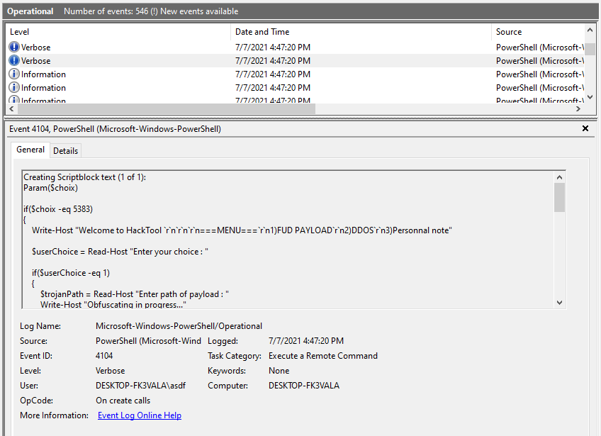
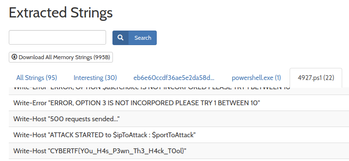

# Trojan Tools
## CyberThreatForce CTF 2021
#### Category: Reversing
#### 7 Jul 2021


description:

> We has find this tools in computer of script kiddies , you need to find the secret of this program.

contents:
- [solving manually](#solution)
- [the easy way](#the-easy-way)
- [P.S.](#ps)

--------------

## solution

We're given an executable called TROJAN_TOOLS.exe. `file` tells us it is 32 bit and UPX compressed:

> TROJAN_TOOLS.exe: PE32 executable (console) Intel 80386, for MS Windows, UPX compressed

First, I dropped the executable into my FLARE VM and renamed it. If we run it in a terminal, we'll see it's asking for a PIN. Providing an argument also fails. I guess asdf isn't the right PIN.

```
.\trojan.exe
Please enter the good PIN

.\trojan.exe asdf
Please enter the good PIN
```

If we start [Sysinternals Process Monitor](https://docs.microsoft.com/en-us/sysinternals/downloads/procmon) and setup a filter for process name trojan.exe, we'll see that the process is creating and writing to a .ps1 file in the AppData directory. ps1 is the extension for a PowerShell script. Then, PowerShell is executed with arguments to the script and the asdf input we provided. And finally, the script is deleted from the AppData folder. Here's how that looks in ProcMon:

```
4:47:19.8785075 PM  trojan.exe  2136   CreateFile  C:\Users\asdf\AppData\Local\Temp\F555.tmp\F556.tmp\F557.ps1 SUCCESS Desired Access: Generic Read/Write
4:47:19.8786155 PM  trojan.exe  2136   WriteFile   C:\Users\asdf\AppData\Local\Temp\F555.tmp\F556.tmp\F557.ps1 SUCCESS Offset: 0, Length: 2,488, Priority: Normal

4:47:19.8834078 PM  trojan.exe  2136   Process Create  C:\Windows\SysWOW64\WindowsPowerShell\v1.0\PowerShell.exe   SUCCESS PID: 3080, Command line: "PowerShell" –NoProfile -ExecutionPolicy Bypass -File C:\Users\asdf\AppData\Local\Temp\F555.tmp\F556.tmp\F557.ps1  asdf

4:47:21.9054454 PM  trojan.exe  2136   SetDispositionInformationEx C:\Users\asdf\AppData\Local\Temp\F555.tmp\F556.tmp\F557.ps1 SUCCESS Flags: FILE_DISPOSITION_DELETE
```

And, if we browse to the AppData folder, we'll find that the script was indeed deleted. Fortunately, Windows has the ability to log the full contents of PowerShell scripts. If we open Event Viewer and browse to
- Applications and Services Logs
    - Microsoft
        - Windows
            - PowerShell
                - Operational

We can find event ID 4104: Execute a Remote Command. This event contains the full contents of PowerShell scripts that have been executed.



```powershell
Param($choix)

if($choix -eq 5383)
{
    Write-Host "Welcome to HackTool `r`n`r`n`r`n===MENU===`r`n1)FUD PAYLOAD`r`n2)DDOS`r`n3)Personnal note"

    $userChoice = Read-Host "Enter your choice : "

    if($userChoice -eq 1)
    {
        $trojanPath = Read-Host "Enter path of payload : "
        Write-Host "Obfuscating in progress..."
        Write-Host "The payload $trojanPath is now obufscated !"
        Write-Error "CRITICAL ERROR, IMPOSSIBLE TO OBFUSCATING PAYLOAD"
    }

    ElseIf ($userChoice -eq 2)
    {
        $ipToAttack = Read-Host "Enter IP to Ddos : "
        $portToAttack = Read-Host "Enter port of target : "
        Write-Host "ATTACK STARTED to $ipToAttack : $portToAttack"
        Write-Host "500 requests sended..."
        Write-Error "CRITICAL ERROR, IMPOSSIBLE TO SEND PACKET"
    }

    ElseIF ($userChoice -eq 3)
    {
        Write-Error "ERROR, OPTION 3 IS NOT INCORPORED PLEASE TRY 1 BETWEEN 10"
    }

    ElseIF ($userChoice -eq 8)
    {
        Write-Host "CYBERTF{Y0u_H4s_P3wn_Th3_H4ck_T0ol}"
    }

    Else
    {
        Write-Error "ERROR, OPTION $userChoice IS NOT INCORPORED PLEASE TRY 1 BETWEEN 10"
    }
}

else
{
    Write-Host "Please enter the good PIN"
}
```

We can plainly see the flag in the script. Also visible is the PIN. If we execute the program with the right options, it will print the flag for us!

```
.\trojan.exe 5383
Welcome to HackTool

===MENU===
1)FUD PAYLOAD
2)DDOS
3)Personnal note
Enter your choice : : 8
CYBERTF{Y0u_H4s_P3wn_Th3_H4ck_T0ol}
```

-----------

## the easy way

If you upload the executable to [Hybrid Analysis](https://www.hybrid-analysis.com/sample/eb6e60ccdf36ae5e2da58d193f5184ca3ef0e316d974ccc1a9e4d949daa56459/60df76d440812722a4554ebc), it will pick strings out of dropped files for you.



-----------

## P.S.

If you don't have PowerShell script block logging enabled, you can fix that by opening Local Group Policy Editor and browsing to
- Administrative Templates
    - Windows Components
        - Windows PowerShell
            - and set _Turn on PowerShell Script Block Logging_ to Enabled

If you're a network defender and don't have this logging enabled in your environment, then I'd highly recommend turning it on. [Attackers frequently use PowerShell](https://attack.mitre.org/techniques/T1059/001/) because it's _powerful_ and widely available, so monitoring it is invaluable.
