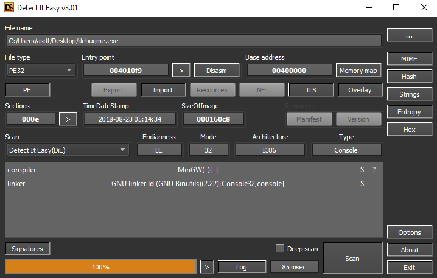
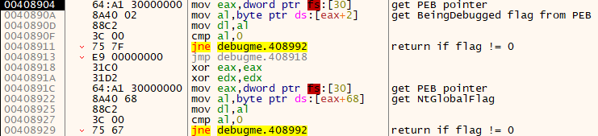
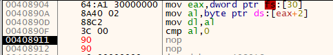
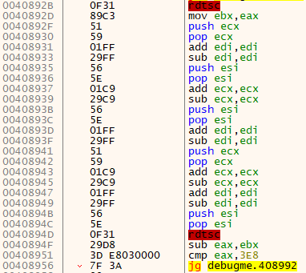
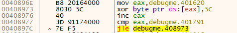
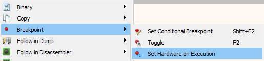
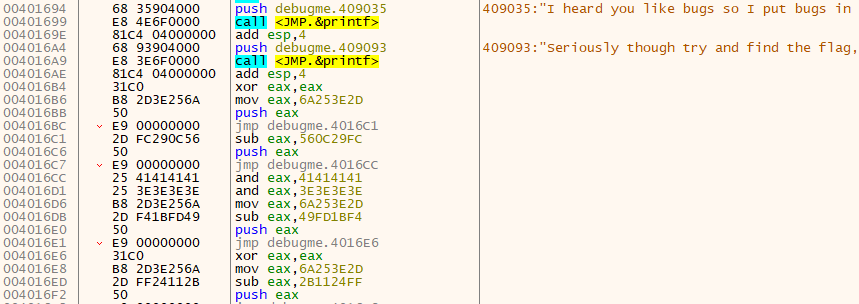
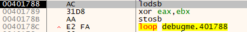
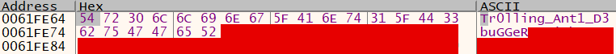

# Debugme - hackthebox writeup

#### 23 Sep 2021

### sections:
- [overview](#overview)
- [debugging](#debugging)
- [Anti-Debugging Techniques](#anti-debugging-techniques)
- [Finding the Flag](#finding-the-flag)

## Overview

I just finished SANS FOR 610 and passed GREM. Phew! In that spirit, lets take a look at some anti-debugging techniques.

Challenge hint:
> A develper is experiementing with different ways to protect their software. They have sent in a windows binary that is suposed to super secureand really hard to debug. Debug and see if you can find the flag.

The hint says we need to try debugging it, so lets try that. I dropped the exe into my FLARE VM and used Detect it Easy (die.exe) to identify it. IT tells us it's a 32 bit program:

## Debugging
So, we'll open x32dbg and start steping through it. The debugger starts paused at some code within ntdll, so I hit F9 to continue past it to the auto breakpoint set at debugme's entry point. First however, we hit another predefined breakpoint at TLS Callback 1:

[Thread Local Storage][tls-callback] allows programmers to initialize data before the entry point of a program. It's possible for malicious code to be placed in a TLS callback, but I chose to skip it on the first run. So, I pressed F9 a couple more times to reach the actual entry point.

## Anti-Debugging Techniques
The entry begins with a jump to 0x408904, so I pressed F8 to follow that and reached this section:

This is our first anti-debugging technique. The program is going to check the BeingDebugged flag within the Process Environment Block (PEB).

Here's how this works. FS is a segment register that points to the F segment. This is an old style of memory segmentation [that has been replaced by the flat layout of paging][segment-registers]. In Windows, the F segment contains the [Threat Information Block (TIB)][tib]. Offset 0x30 within the TIB is a pointer to the [PEB][peb]. Offset 0x2 within the PEB is the BeingDebugged flag. This first set of instructions, from 0x904 through 0x90f, will check if this BeingDebugged flag is set to 0, and jump to 0x408992 if not, which returns from the function. There are numerous other ways for a program to determine if it is being debugged, such as Windows APIs IsDebuggerPresent and CheckRemoteDebuggerPresent.

Now, we don't want to let this program know it's being debugged and exit this function. There are many ways we could prevent this from happening. We could:

- edit the exectable on disk to prevent the program from checking the BeingDebugged flag
- single step to the cmp instruction and set EAX to 0
- patch the jmp instruction in the debugger so the comparison is ignored

The simplest way to move forward here, I think, is to use the debuggers ability to patch instructions on the fly. If you select the instruction at 0x408911 and press space, you'll see a popup allowing you to modify the assembly at this address.

There are several ways to approch this modification as well. If you knew where you want to jump to, you could enter that address instead. You could also reverse the logic to je and only jump if the program was not being debugged. Easiest, I think, is to replace all the opcodes with no-operation nop instructions, since bypassing the jump would take us to the code we want to execute. So, change the text box to _nop_. Note that this jne instruction is actually two bytes long, 75 7F, and a nop is only one byte. It is not okay to delete any bytes of code because of the way x86 programs jump around using hard-coded addresses and relative offsets. This could break the program. So, be sure to check the _Fill with NOP's_ box to keep the overwritten instructon the same size.

The program still checks the BeingDebugged flag, but is now unable to act on it.

Then, the program examines another byte from the PEB, this time at offset 0x68. At this offset is the NtGlobalFlag, another way for programs to identify if they are being debugged. We'll need to NOP out the following jump as well.

Then the program executes the [rdtsc] instruction, Read Time-Stamp Counter, which returns the CPU's internal clock cycle counter. Then some nonsense instructions, like `push ecx; pop ecx` are run to take up some cycles. Then, rdtsc is executed again, and the difference from the first result is calculated. If this is greater than 0x3e8, the program will jump to the exit routine at 0x408992.

This time comparison is another anti-debugging technique. It would certainly take more than 0x3e8 clock cycles to single-step through all the junk code between the rdtsc instructions, and then the program would assume it's being debugged. There are many other ways for programmers to implement time-based anti debugging, such as API calls GetLocalTime, GetSystemTime, GetTickCount, etc.

If we also NOP out the jump following the second rdtsc instruction, we can continue as normal.

Following the time check and a series of NOPs, we find a XOR decryption loop.

This loop will XOR each byte from 0x401620 through 0x401790 with the value 0x5c. These addresses are within the program's .text section, which means we're probably about to modify executable code. If the programmer bothered to hide this code by XORing it during run-time, it probably does something interesting that we should inspect.

It's a good bet that this code will be executed after the XOR loop is done, so we can go ahead and set a break point on the loop's start address. To do this, first press _Alt-G_ and enter _401620_ to go that address. For now, this is garbage code obscured by the XOR key.

We want to set a breakpoint at this spot, but a software breakpoint you'd set using F2 won't work in this case. This is because a software breakpoint actually patches the instruction, temporarly replacing it with an int3 (CC) instruction. This will cause an issue because the XOR loop will modify this CC instruction rather than the original byte value. Instead of a software breakpoint, we'll set a hardware breakpoint which uses special debug registers within the CPU to pause execution. To do this, right click the line at 0x401620 and navigate to _Breakpoint -> Set Hardware on Execution_.

Then, press F9 to run the program and you should hit the breakpoint!

Now, you should see that the instructions starting at 0x401620 have been modified. We can see some similar code that we bypassed before: using fs:[30] to get the PEB and checking the debug flags, and using rdtsc to measure if execution is occuring too slowly. We can simply NOP out the jumps following each comparison and move on.

## Finding the Flag
After passing all three anti-debug techniques again, we finally reach some interesting code.

We're printing strings about flags, and pushing some DWORDs to the stack which look like a pattern of building a stack string. Further down is a loop and XOR routine that will decrypt the content of the stack string.

If we select the instruction immediately after the loop, 0x40178e, we can press F4 to execute to there. Then follow ESP in dump, and you can see the flag. Now go find the rest of it yourself!

[tls-callback]: https://isc.sans.edu/diary/How+Malware+Defends+Itself+Using+TLS+Callback+Functions/6655
[tib]: https://en.wikipedia.org/wiki/Win32_Thread_Information_Block
[peb]: https://en.wikipedia.org/wiki/Process_Environment_Block
[peb-structure]: https://docs.microsoft.com/en-us/windows/win32/api/winternl/ns-winternl-peb
[ntglobal]: https://www.aldeid.com/wiki/PEB-Process-Environment-Block/NtGlobalFlag
[segment-registers]: https://reverseengineering.stackexchange.com/questions/2006/how-are-the-segment-registers-fs-gs-cs-ss-ds-es-used-in-linux
[rdtsc]: https://www.felixcloutier.com/x86/rdtsc
